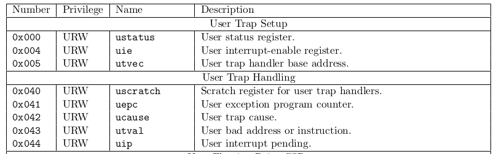

- [Voorbereiding](#voorbereiding)
- [GitHub classroom](#github-classroom)
- [Traps](#traps)
  - [Traps in RISC-V](#traps-in-risc-v)
    - [Control and status registers](#control-and-status-registers)
    - [Delegation register](#delegation-register)
    - [Trap vectors](#trap-vectors)
  - [Virtual memory](#virtual-memory)
    - [Trampoline](#trampoline)
  - [Floating point ondersteuning](#floating-point-ondersteuning)
- [Toepassingen van exceptions](#toepassingen-van-exceptions)
  - [Error handling](#error-handling)
  - [System calls](#system-calls)
  - [Demand paging](#demand-paging)
  - [Debugging](#debugging)
- [Interrupts](#interrupts)
  - [Interrupts in xv6](#interrupts-in-xv6)
  - [Device drivers](#device-drivers)
  - [Timer interrupts](#timer-interrupts)
  - [Interrupt counters](#interrupt-counters)
- [Permanente Evaluatie](#permanente-evaluatie)
  - [Lazy allocation](#lazy-allocation)
  - [Bonusoefening](#bonusoefening)

# Voorbereiding

Ter voorbereiding van deze oefenzitting word je verwacht:

* De oefenzitting virtual memory te hebben voltooid.
* Hoofdstuk 4 en 5 van het [xv6 boek](https://github.com/besturingssystemen/xv6-riscv) te hebben gelezen.

# GitHub classroom

De submissie van de permanente evaluatie zal gebeuren via GitHub classroom.

> :exclamation: Voor elke sessie wordt een nieuwe repository ter beschikking gesteld. De oude repository wordt afgesloten op de deadline van de permanente evaluatie!

* Klik op [deze link](https://classroom.github.com/a/mCjxHsOw) om een persoonlijke repository aan te maken.

Wanneer je een e-mail krijgt van GitHub dat je repository klaar is, moet je deze clonen naar je eigen machine. Dit kan enkele minuten duren.

Indien `make qemu` ervoor zorgt dat xv6 opstart, is je repository correct gecloned.

# Traps

De uitvoering van machinecode door een processor is meestal erg voorspelbaar:

1. Een instructie wordt geladen op de locatie waarnaar de program counter verwijst.
2. De instructie wordt uitgevoerd
3. De programmateller wordt verhoogd
4. Herhaal

Sommige machine-instructies, zoals jumps, passen expliciet de programmateller aan.
Zo implementeren we lussen, functies, enzovoort.

Het kan echter ook gebeuren dat een instructie *faalt*.
Denk bijvoorbeeld aan de volgende simpele instructie:

```asm
sd t0, (t1)
```

De waarde in register `t0` wordt opgeslagen op het adres in register `t1`.
Indien we deze instructie uitvoeren op een RISC-V processor waarop *virtual memory* enabled is, in bijvoorbeeld *user mode*, kan het zijn
dat deze instructie niet mag uitgevoerd worden.
Het kan namelijk zijn dat de pagina van het adres niet gemapt is als *writable*.
Hoe kan de processor deze instructie dan uitvoeren?

In dit specifieke scenario zal de processor een *exception* genereren.
Iedere *exception* veroorzaakt een *trap*.
In plaats van de *faulting instruction* uit te voeren, zal de processor springen naar een andere locatie in het geheugen.
Op die locatie vinden we een *trap handler*.
Dit is code, typisch een deel van het besturingssysteem, op een vaste locatie in het geheugen.
Deze code heeft de specifieke taak om te identificeren wat het probleem was en om vervolgens te beslissen of het al dan niet opgelost kan worden.

Na het lezen van bovenstaande paragraaf maak je misschien enkele terechte bedenking: in welke adresruimte bevindt zich de trap handler?
In de adresruimte van de kernel, of die van het user proces?
Of staat de trap handler op een fysiek adres?
Wijzigt het privilegeniveau van de processor bij het afhandelen van een trap?

Om hierop te antwoorden moeten we even uitleggen exact hoe een trap in RISC-V afgehandeld wordt.

## Traps in RISC-V

### Control and status registers

RISC-V heeft een verzameling speciale registers genaamd *control and status registers* (CSR).
Deze registers worden specifiek gebruikt om bepaalde speciale functionaliteiten te kunnen implementeren, zoals exceptions.
In onderstaande afbeelding uit de [RISC-V specificaties](https://riscv.org/technical/specifications/) worden enkele van deze CSRs gerelateerd aan exception handling beschreven:



Merk op dat elk van deze registers de letter `s` als prefix heeft.
Deze `s` staat voor supervisor-mode.
Deze specifieke registers kunnen gebruikt worden door de processor, wanneer deze in supervisor mode (of een hoger privilegeniveau) uitvoert.
Elk van deze registers hebben ook een `u`- en `m`-equivalent (bijvoorbeeld `ustatus` en `mstatus`).
`ustatus` kan gelezen worden in alle modes, `mstatus` enkel in machine mode.

### Delegation register

Op het moment dat een trap optreedt, moet beslist worden in welk privilegeniveau deze afgehandeld moet worden.
Standaard is dit in machine mode, het hoogste privilegeniveau.
Er is echter een mogelijkheid voorzien om traps te forwarden naar supervisor mode of user mode.

Om traps te forwarden wordt gebruik gemaakt van speciale delegatieregisters (dit zijn ook CSRs).
In totaal zijn er vier verschilende delegatieregisters: `medeleg`, `sedeleg` voor exceptions en `mideleg` en `sideleg` voor interrupts.
Op het gedeelte interrupts komen we later in de sessie terug.

Indien de oorzaak van de trap een exception was, wordt gekeken in het `medeleg` register.
Elke bit van dit register is gelinkt aan een specifieke exception.
Indien de bit van een specifieke exception op `1` staat, wordt deze exception doorgestuurd naar het volgende (lagere) privilegeniveau.
Indien de specifieke processor een supervisor mode heeft, zal de exception dus in supervisor mode afgehandeld worden.
Via `sedeleg` kunnen vervolgens exceptions verder doorgestuurd worden naar user mode, op dezelfde wijze.

### Trap vectors

Eenmaal bepaald is in welke modus een exception moet afgehandeld worden, worden de overeenkomstige CSRs geconsulteerd.
De registers `mtvec`, `stvec` en `utvec` bevatten respectievelijk de adressen van de machine mode trap handler, supervisor mode trap handler en user mode trap handler.

Stel dat de exception in machine mode wordt afgehandeld.
De oorzaak van de exception wordt geschreven naar het CSR `mcause`.
De waarde van de program counter op het moment dat de exception zich voordeed, wordt geschreven naar `mepc`.
Indien de exception veroorzaakt werd door een adres aan te spreken, zal de waarde van dit adres in `mtval` geplaatst worden.
In de andere privilegeniveaus gebeurt exact hetzelfde, maar dan met de registers van dat privilegeniveau.

De tabellen uit de specs voor [mcause](img/mcause.png) en [scause](img/scause.png) kunnen gebruikt worden om te bepalen welke waarde in deze registers geplaatst worden per interrupt of exception.

* **Oefening** Een programma in user-mode voert de instructie op adres `0x4B1D` uit: `sd t0, 0x0FF1C0`. Dit adres bevindt zich in een pagina die niet schrijfbaar is. De waarde van het `medeleg` register staat op `0xffffffff`, de waarde van het `sedeleg` register op `0x0`. In `mtvec` staat het adres `0xdeadbeef`, in `stvec` staat het adres `0xcafebabe` en in `utvec` staat het adres `0xBAADF00D`. Op welk adres bevindt zich de trap handler die de exception zal afhandelen? In welk privilegeniveau wordt de exception afgehandeld? Welke waarden zullen er in de `xcause`, `xepc` en `xtval` registers geplaatst worden (en welke letter is *x*)?

> :bulb: Een pagina aanspreken op een niet-toegelaten manier veroorzaakt altijd een page fault. Het soort instructie dat je uitvoert bepaalt de soort page fault die zal optreden. Instructies die schrijven naar geheugen zonder toegang veroorzaken store page faults, instructies die lezen uit geheugen zonder toegang load page faults. Een instruction page fault treedt op wanneer de instructie die uitgevoerd moet worden op een pagina staat zonder de correcte permissies.

## Virtual memory

We weten nu het hardware-mechanisme waarmee traps afgehandeld kunnen worden.
Er rest ons echter nog een belangrijke vraag om te beantwoorden: worden virtuele of fysieke adressen gebruikt bij het afhandelen van traps?
Dit hangt volledig af van de huidige configuratie van de processor en van het privilegeniveau waarin de trap afgehandeld wordt.
Machine-mode ondersteunt geen virtual memory dus wanneer een trap in die mode afgehandeld wordt door naar `mtvec` te springen, zullen er fysieke adressen gebruikt worden.
In de andere modes hangt het af van de huidige configuratie van van virtual memory.
Indien paging aanstond op het moment dat de trap zich voordoet, zal de waarde in de `xtvec` registers verwijzen naar virtuele adressen via de huidige page table in `satp`.
Het adresvertalingsmechanisme blijft dus actief.

Zeer attentieve studenten merken hierbij misschien een probleem op.
Stel dat we van privilegeniveau wijzigen door de exception.
Neem bijvoorbeeld aan dat we een exception hebben die zich voordoet in user-mode en afgehandeld wordt in supervisor-mode.
Op het moment dat de processor springt naar de waarde in `stvec` zal `satp` nog steeds verwijzen naar de page table van het user proces.
De adresvertaling gebeurt dus nog steeds volgens de mapping van het user proces. De processor zal dus springen naar code in de user space met een hoger privilegeniveau (in dit geval supervisor mode).

Een besturingssysteem zal er dus voor zorgen dat er kernel code geschreven wordt op het adres `stval` en dat het proces zelf deze code niet kan bewerken (door de pagina niet schrijfbaar te maken en de `U`-bit te deactiveren).
De code op dat adres kan vervolgens de waarde van `satp` wijzigen, en zo de page tables van de kernel activeren, om ervoor te zorgen dat we verder kunnen uitvoeren in de adresruimte van de kernel zelf.

De code die verantwoordelijk is voor het opvangen van traps in xv6 bevindt zich in de trampolinepagina.
De trampolinepagina is gemapt op het hoogste adres in de virtuele adresruimte van *elk* user space proces.

### Trampoline

Het is je misschien opgevallen dat de *trampoline* niet enkel gemapt is in de adresruimte van elk user space proces maar ook in de adresruimte van de kernel zelf.
Ook in de kernel is deze pagina gemapt op het hoogst mogelijke virtuele adres.

Eerder hebben we vermeld dat de trampolinepagina `satp` zal wijzigen.
`satp` wijzigen zorgt er echter voor dat plotseling alle virtuele adressen volgens een volledig andere mapping vertaald worden.
De program counter zelf bevat het virtuele adres van de huidige locatie in de code!
Indien, bij een wisseling van user space naar kernel space, de trampolinepagina niet op hetzelfde virtuele adres gemapt is in beide adresruimten, zal de volgende instructie die geladen wordt door de processor zich niet bevinden in de trampolinepagina.
Om dat te vermijden wordt deze pagina dus op hetzelfde virtuele adres gemapt in iedere adresruimte.

* Bekijk nu de code van [`kernel/trampoline.S`][trampoline]

Zoals je kan zien voert de trampoline twee taken uit:

1. Het [bewaren][trampoline save regs] (en [herstellen][trampoline restore regs]) van alle registerwaarden in de [`trapframe`][trapframe]. Dit is nodig om te verzekeren dat bij terugkeer uit de trap, het actieve programma kan voortgezet worden met correcte registerwaarden.
  Merk op dat xv6 het `sscratch` CSR gebruikt om het adres van de trapframe van het huidige proces op te slaan.
  Dit is een speciaal register waar de processor zelf nooit iets mee doet en dus door de kernel gebruikt mag worden als _scratch_ register.
2. Het wijzigen van de `satp` om zo te wisselen van page tables bij transities tussen user space en kernel space ([naar kernel][satp kernel], [naar user][satp user]).
  Na het switchen van de page table wordt de `sfence.vma` instructie gebruikt om de TLB te flushen.

Bij de overgang van user space naar kernel space wordt, aan het einde van de trampolinepagina, de kernel-functie [`usertrap()`][usertrap] opgeroepen in `kernel/trap.c`.
Om terug te keren van kernel space naar user space definieert de trampolinepagina de functie `userret`.

* **Oefening** De trampolinepagina staat gemapt met `R` (read) en `X` (execute) permissies. Daarnaast is de pagina enkel toegankelijk in supervisor mode (de `U`-bit is inactief). Stel dat de trampolinepagina ook `W` (write) permissies zou hebben en user-mode access zou enabled zijn. Wat voor probleem zou dit kunnen opleveren?
 
## Floating point ondersteuning

Het is je misschien opgevallen dat alle user space programma's die we tot nu toe geschreven hebben, enkel _integer_ operaties gebruiken.
RISC-V ondersteunt ook _floating point_ operaties om niet-gehele getallen te bewerken.
Op de meeste processoren, alsook op RISC-V, worden zulke operaties uitgevoerd door een zogenaamde _floating point unit_ (FPU).
Deze FPU zal berekeningen uitvoeren op speciale registers die onafhankelijk zijn van de general purpose registers die gebruikt worden voor integer operaties.
Op RISC-V zijn er 32 floating point registers genaamd `f0` tot `f31`.

1. Voeg het volgende user space programma toe dat gebruikt maakt van floating point operaties:
   ```c
   #include "user.h"

   double get_sum() {
     double sum = 0;

     for (double d = 1.23; d < 100; d *= 1.9) {
       sum += d;
     }

     return sum;
   }

   int main() {
     double sum = get_sum();
     printf("Sum: %d\n", (int)sum);
     return 0;
   }
   ```
   Op RISC-V beginnen alle floating point instructies met een `f`, bijvoorbeeld: `fld` (float load), `fadd`, `fmul`.
   Verifieer dat dit programma daadwerkelijk zulke instructies gebruikt door via `objdump` de assembly code van de `get_sum` functie af te printen (vervang `user/_test` door de executable van je eigen programma):
   ```shell
   riscv64-linux-gnu-objdump --disassemble=get_sum user/_test
   ```

2. Voer de executable nu uit in xv6.
   Je zult merken dat het crasht door een exception.
   Welke exception wordt er precies gegenereerd en door welke instructie?

Op RISC-V staat de FPU uit na het opstarten.
Het [`mstatus`](img/mstatus.png) CSR bevat twee bits (`FS`) die de status van de FPU beheren.
De FPU kan aangezet worden door `FS` op `01` te zetten.

3. Zorg ervoor dat de FPU globaal aanstaat.
   De initiële waarde voor `mstatus` [wordt gezet][write mstatus] in de functie [`start`][start], de eerste C-functie die in de kernel wordt uitgevoerd.
   Je kan zien dat `mstatus` eerste gelezen wordt in de variabele `x` (geweldige naam!) via de functie [`r_mstatus`][r_mstatus].
   Dan worden er een aantal configuratie bits gezet in `x` (je hoeft niet te begrijpen wat deze precies doen) vooraleer `x` terug naar `mstatus` geschreven wordt via [`w_mstatus`][w_mstatus].
   Je kan de FPU dus aanzetten door de eerste bit van `FS` (bit 13 van `mstatus`) op 1 te zetten in de variabele `x`.
   > :bulb: Je kan in C een getal maken dat enkel bit 13 op 1 heeft staan via `(1 << 13)`.

> :information_source: De Linux kernel staat voor efficiëntie redenen geen floating point code toe in kernel mode.
> De FPU zal daar dus niet globaal aanstaan maar enkel bij het switchen naar user mode aangezet worden.
> Ook de meeste user mode programma's maken geen gebruik van de FPU en het kan dus qua energieverbruik beter zijn om ook voor user space programma's de FPU niet standaard aan te zetten.
> De kernel zou bijvoorbeeld de exception die gegenereerd wordt wanneer er een floating point instructie gebruikt wordt terwijl de FPU uitstaat op kunnen vangen en de FPU dan pas aanzetten.
> Om deze oefening eenvoudig te houden, zetten we de FPU globaal aan maar we houden jullie niet tegen om een efficiëntere implementatie uit te proberen.

Verifieer nu dat je test programma uitgevoerd kan worden zonder exceptions te genereren.

4. Voeg nu het volgende user space programma toe:
   ```c
   #include "user.h"

   double get_sum() {
     double sum = 0;

     for (double d = 1.23; d < 100; d *= 1.9) {
       sum += d;
       sleep(1);
     }

     return sum;
   }

   int main() {
     double sum = 0;

     if (fork() != 0) {
       sum = get_sum();
       wait(0);
     } else {
       sum = get_sum();
     }

     printf("Sum: %d\n", (int)sum);

     return 0;
   }

   ```
   Dit programma voert een gelijkaardige lus uit als het vorige maar doet dit in een parent en in een child proces.
   Verder zal in elke iteratie van de lus een syscall gebeuren.
   > :information_source: `sleep(n)` in xv6 zal het oproepende proces `n * 100ms` doen slapen.
   > Dit geeft andere processen de tijd om uit te voeren.

   Merk je iets op?
   Voer dit programma meerdere keren uit en bekijk de resultaten.

Je hebt waarschijnlijk gemerkt dat je inconsistente resultaten krijgt (zo niet, ga terug naar punt 4).
Zoals eerder uitgelegd, moet de code in de trampoline de waarden in de general purpose register opslaan in het trapframe om de waarden niet te verliezen.
De FPU gebruikt echter andere registers en deze worden niet bewaard in het trapframe.

5. Zorg ervoor dat de floating point registers juist opgeslagen en herstelt worden door de trampoline code:
    - Breid [`struct trapframe`][trapframe] uit.
    - Voeg code toe aan de [trampoline][trampoline] om alle floating point registers op te slaan in (gebruik de `fsd` instructie) en weer te herstellen uit (`fld`) het trapframe.
6. Verifieer dat je test programma nu _wel_ consistente resultaten geeft.

# Toepassingen van exceptions

We kennen nu het mechanisme waarmee traps worden afgehandeld en hebben reeds onze eerste ervaringen met exceptions gehad.
Laten we nu eens kijken naar enkele toepassingen van exceptions.
Nadien bespreken we interrupts, die ook door traps afgehandeld worden.

## Error handling

De meest standaard toepassing waaraan gedacht wordt bij exceptions is het afhandelen van fouten.

Zo is er bijvoorbeeld een regel in RISC-V dat een `lw` (load word) instructie enkel mag opgeroepen worden met een adres dat een veelvoud is van 4. Een word is 4 bytes groot, als we ons geheugen opdelen in words is het byte-adres van ieder word namelijk een veelvoud van 4.
Wanneer we een `lw` instructie proberen uitvoeren met een adres dat geen veelvoud is van 4, wordt de exception *load address misaligned* gesmeten.

Zoals we weten, wordt vervolgens de controle doorgegeven aan de trap handler in één van de verschillende privilegeniveau's, afhankelijk van de waarde van de delegatieregisters.
Laten we even aannemen dat de exception in de kernel wordt afgehandeld, in supervisor mode.

Wat kan een kernel doen om dit probleem op te lossen?
De handler zou kunnen beslissen om de `lw` instructie over te slaan, maar dan zou het uitvoerende proces incorrect werken.
In de meeste gevallen is het antwoord dus simpelweg, het proces vroegtijdig beeïndigen en een boodschap geven dat het proces een exception heeft veroorzaakt met daarbij informatie over de specifieke exception.

De boodschap *segmentation fault* die je krijgt in vele Linux-distributies is een voorbeeld van een exception die niet opgelost kan worden door het besturingssysteem als gevolg van een fout in het programma.

In xv6 kennen jullie ondertussen reeds de foutboodschap `usertrap` en `kerneltrap`, die getoond wordt wanneer xv6 een exception niet kan oplossen.

<!-- 
* **Oefening:** **TODO** In jullie xv6 repository hebben we enkele simpele programma's toegevoegd, die elk exceptions veroorzaken.
Voer deze programma's uit en gebruik de tabel [scause](img/scause.png) om te bepalen wat er misloopt.
Gebruik het commando `risc64-linux-gnu-objdump -d <executable>` om te achterhalen naar welke regel code de programmateller verwees op het moment dat de exception zich voordeed. Probeer ten slotte het probleem op te lossen door het `.S` bronbestand te wijzigen.
-->

## System calls

Misschien is het je opgevallen dat environment calls (system calls) ook in de scause tabel stonden.
Zoals eerder reeds vermeld in de oefenzitting over system calls, worden deze geïmplementeerd met behulp van exceptions.

De `ecall` instructie genereert expliciet een exception.
De code van de exception verschilt afhankelijk van het privilegeniveau waarin de `ecall` uitgevoerd wordt.
Zo kan je ook vanuit de kernel een `ecall` uitvoeren, die dan in machine mode opgevangen zou kunnen worden.

* Bekijk de code in [`usertrap()`][usertrap]. Herinner je dat deze functie opgeroepen wordt door de trampoline. Je zou ondertussen de code in usertrap moeten begrijpen. Merk op dat deze code ofwel een system call oproept, ofwel een interrupt afhandelt (hierover meer in volgende sectie) ofwel de error message print die we in vorige oefening hebben gedecodeerd.

In het geval van een system call wordt dus [`syscall()`][syscall] opgeroepen, een methode die jullie ondertussen goed zouden moeten kennen.

## Demand paging

Exceptions worden dus niet enkel gebruikt om fouten op te lossen, ook voor system calls.
Een andere interessante toepassing van exceptions is de implementatie van demand paging.
Demand paging in het algemeen zorgt ervoor dat een pagina van een proces pas gealloceerd en gemapt worden de eerste keer dat deze pagina wordt aangesproken.

Neem het voorbeeld van een ELF-bestand.
Stel dat we geen enkel segment van het ELF-bestand in het geheugen laden. We starten met een page table waarin enkel de trampolinepagina en het trapframe gemapt staat en springen naar het entry point van het ELF bestand (het virtueel adres waar de eerste instructie van het programma zich bevindt).

Op dat moment wordt een page fault exception gegenereerd.
Het entry point zal namelijk niet gemapt zijn.
De trap handler vangt deze page fault exception op en kan op dat moment de kernel vragen om enkel deze specifieke pagina te mappen.
Vervolgens kan de code op dat adres wel ingeladen worden en verder uitgevoerd worden.
Pagina's worden dus pas gemapt op het moment dat ze worden aangesproken.
Om demand paging te implementeren maken we dus gebruik van exceptions.

## Debugging

Debuggers worden ook mogelijk gemaakt dankzij exceptions.
Net zoals de `ecall`-instructie een exception genereert en de controle doorgeeft aan de trap handler, zo zal ook de `ebreak`-instructie een exception genereren, met een specifieke exception code.

Wanneer je met behulp van een debugger een breakpoint plaatst in een programma, wordt de instructie waarop je een breakpoint plaatst vervangen door de `ebreak`-instructie.
Op het moment dat de instructie normaal gezien zou uitvoeren, zal je dus in plaats daarvan een exception genereren.
Deze kan dan opgevangen worden door een trap handler, die vervolgens de controle door kan geven aan de debugomgeving.
De executie van het programma is op dat moment gepauzeerd, de debugomgeving kan functionaliteit aanbieden die het mogelijk maakt de toestand van het geheugen en de registers te inspecteren.

<!--
In komende oefening zullen we een simpele debugger implementeren voor xv6, gebruik makend van exceptions.

* **TODO**
* **Oefening** (misschien?): basic debugger schrijven voor xv6:
  * `./dump_registers <symbol> <executable> <args>`
  * Instructie op locatie `<symbol>` vervangen door `ebreak`
  * User-mode handler in dump_registers.S
  * In geval van ebreak exception
  * Dump alle registers naar stdout
  * Vervang `ebreak` terug door originele instructie
  * continue

-->

# Interrupts

Tot nog toe hebben we voornamelijk gesproken over exceptions, die traps veroorzaken waarbij de controle wordt doorgegeven aan een trap handler.
Traps kunnen echter ook veroorzaakt worden door een tweede mechanisme, net iets complexer, genaamd *interrupts*.

Op sommige momenten is het nodig om informatie te geven aan processen die actief zijn, zonder dat de programma's op dat moment zelf om die informatie vragen.

Denk bijvoorbeeld je toetsenbord.
Op het moment dat je een toets indrukt, verschijnt een letter op het scherm.
De kans is echter zeer groot dat op het moment dat je die toets indrukt,
de processor druk bezet is met het uitvoeren van andere, ongerelateerde instructies.
Er is dus een manier nodig om de processor te onderbreken.

Exceptions onderbreken de flow van een proces, maar deze worden veroorzaakt door het uitvoeren van een (al dan niet foutieve) instructie.
Toetsaanslagen kan je echter niet voorspellen en kunnen voorkomen op elk mogelijk moment gedurende de uitvoer van een proces.
Wanneer we de flow van een processor willen onderbreken op een niet-voorspelbaar tijdstip maken we gebruik van een *interrupt*.

Tussen elke instructie die een processor uitvoert zal gecontroleerd worden of er een interrupt actief is.
Indien dit het geval is, trapt de processor.
Het is mogelijk om interrupts tijdelijk volledig te disablen, om ervoor te zorgen dat bepaalde code nooit onderbroken kan worden.

## Interrupts in xv6

Interrupts zijn standaard actief gedurende de uitvoering van xv6-code.
Indien een interrupt voorkomt, zal de processor, wanneer deze klaar is met het uitvoeren van de actieve instructie, springen naar de trap handler in onze welgekende trampolinepagina, net zoals in het geval van exceptions.

Zoals we weten roept de trampoline [usertrap()][usertrap] op, waarin vervolgens de functie [`devintr()`][devintr] wordt opgeroepen.
In deze functie kunnen we zien dat xv6 drie soorten interrupts kan afhandelen: `UART` interrupts, `VIRTIO` interrupts en timer interrupts.

## Device drivers

[*UART*](https://en.wikipedia.org/wiki/Universal_asynchronous_receiver-transmitter) staat voor *universal asynchronous receiver-transmitter*.
Dit is een apparaat dat gebruikt kan worden om (seriële, dus bit per bit) communicatie mogelijk te maken tussen een processor en externe apparaten.
Vroeger verliep de communicatie tussen een toetsenbord en een processor bijvoorbeeld typisch via een UART-apparaat.
Vandaag verloopt dit meestal via een *universal serial bus*, beter gekend als [*USB*](https://en.wikipedia.org/wiki/USB).

Wanneer we een toetsenbord aansluiten, bijvoorbeeld via een UART of via USB, kan informatie verstuurd worden naar de processor, zoals de ingedrukte toetsaanslagen. Om deze informatie echter te ontvangen, hebben we nood aan een programma dat weet hoe te communiceren met het apparaat.
Dat soort programma noemen we een *driver*.

De `qemu` emulator emuleert een UART-apparaat.
Wanneer je in je Ubuntu-console xv6 opstart en vervolgens in de terminal typt, wordt deze informatie via de geëmuleerde UART doorgestuurd.
In xv6 lijkt het dus vervolgens alsof er rechtstreeks via een UART informatie binnenkomt.

xv6 heeft dus ook een UART driver. Deze kan je terugvinden in [`kernel/uart.c`][uart].
Driver code is complex en zeer gebonden aan specifieke apparaten, en dus ook weinig interessant om te bestuderen.
Wel interessant is om te kijken hoe de samenwerking met interrupts net werkt.

Wanneer we drukken op een toets van een toetsenbord aangesloten via UART op xv6, gebeuren de volgende stappen:

1. De ingedrukte toets gestuurd van het toetsenbord naar de UART
2. De UART genereert vervolgens een IRQ (interrupt request) op de processor
3. Indien interrupts actief zijn zal de processor na afloop van de huidige instructie springen naar de correcte trap handler (ook voor interrupts zijn er delegatieregisters)
4. De trap handler determineert dat de reden van de trap een interrupt was en geeft de controle door aan [`devintr()`][devintr]
5. [`devintr()`][devintr] leest de waarde van de IRQ, bepaalt dat het een UART-interrupt was en geeft de controle door aan [`uartintr()`][uartintr] in de UART driver.
6. [`uartintr()`][uartintr] leest een karakter uit de UART en stuurt dit door naar de console van xv6

UART communicatie kan in twee richtingen werken.
De console van xv6 stuurt de output van de console ook via UART terug naar `qemu`, die het toont in je Ubuntu-terminal.

Merk op dat de essentie van deze device driver dus gebaseerd is op interrupts.
UART drivers kunnen ook geïmplementeerd worden zonder interrupts.
Dit kan door met behulp van een proces dat voortdurend actief is in een lus kijkt of er een karakter in de UART buffer staat.
Deze techniek noemen we *polling*.
Voor apparaten die weinig invoer sturen op onregelmatige momenten zijn interrupts meestal efficiënter.
Indien een apparaat voortdurend informatie verstuurt kan polling de betere oplossing zijn, om interrupt overhead te vermijden.

De `VIRTIO` driver ten slotte wordt gebruikt om een harde schijf te ondersteunen. Hier gaan we in deze oefenzitting verder niet op in.

## Timer interrupts

Wanneer meerdere processen op hetzelfde moment actief zijn binnen een besturingssysteem, zal de processor in vele gevallen deze processen afwisselend uitvoeringstijd toekennen.
Indien dit snel genoeg verloopt, krijg je de illusie dat de programma's effectief in parallel draaien.
Wat dit in feite wil zeggen, is dat er een manier nodig is om ervoor te zorgen dat programma's om de zoveel tijd onderbroken worden.
Het besturingssysteem wil dus in feite een proces opstarten en een timer instellen.
Wanneer deze timer afloopt, is een nieuw proces aan de beurt.

Om dit mogelijk te maken wordt vaak een hardwarematige timer gebruikt.
Deze timer kan geprogrammeerd worden om een interrupt te sturen na een instelbare tijd.
Dit soort interrupt noemen we een timer interrupt.

Deze timer wordt in xv6 opgestart bij het booten van het besturingssysteem.
Met alle informatie die we in deze oefenzitting verzameld hebben is het interessant om eens een kijkje te nemen in de boot code.

* Lees de code in [kernel/start.c][start]. Probeer de code te begrijpen aan de hand van de commentaren en de kennis die je in deze sessie hebt opgedaan.

Deze code wordt opgeroepen als deel van de boot van xv6 en bevat de code waarin de processor geconfigureerd wordt. 
Aan het einde van de configuratie wordt (via `mret`) overgegaan naar supervisor mode en de controle doorgegeven aan de main-functie in de kernel.
Eerder hebben jullie hier reeds de floating point unit van de processor aangezet.
Merk op dat hier de timer interrupts ook geactiveerd worden.

* Hoeveel clockcycli zal een proces in xv6 ongeveer kunnen uitvoeren alvorens het wordt onderbroken door een timer interrupt?

Timer interrupts in RISC-V worden altijd opgevangen door machine mode en worden dus niet gedelegeerd naar supervisor mode of user mode via delegatieregisters.
In xv6 zijn dit de enige interrupts en exceptions die door machine mode worden afgehandeld.
Je kan in [`start()`][start] zien dat alle andere exceptions gedelegeerd worden naar supervisor mode.
In de functie [`timerinit()`][timerinit] wordt om die reden de machine mode trap handler geconfigueerd zodat deze verwijst naar een trap handler specifiek geschreven voor timer interrupts, namelijk de functie [`timervec`][timervec] in `kernel/kernelvec.S`.

Om ervoor te zorgen dat timer interrupts uiteindelijk toch in supervisor mode afgehandeld kunnen worden, zal deze functie, na het [instellen van de volgende time interrupt][schedule next timer irq], een _supervisor software interrupt_ [triggeren][raise ssi].
Zoals de naam doet uitschijnen, is een software interrupt een interrupt die niet door externe hardware, maar door software expliciet getriggered wordt.
In RISC-V kunnen interrupts door software getriggered worden door naar een _interrupt pending_ CSR te schrijven, in dit geval het `sip` CSR.
Dit zorgt ervoor dat een timer interrupt indirect toch in supervisor mode [opgevangen kan worden][handle ssi].

## Interrupt counters

We gaan nu een syscall toevoegen die ons informatie geeft over het aantal interrupts dat er zijn gebeurd sinds xv6 opgestart is.
Er zijn drie types interrupts die xv6 afhandelt: timer, UART en disk (VIRTIO) en we willen aparte informatie krijgen over alle types.
xv6 houdt momenteel niet bij hoe vaak interrupts voorkomen.

1. Pas [`devintr`][devintr] aan om per type interrupt een aparte teller te verhogen.
  > :bulb: Timer interrupts worden naar _alle_ CPUs gestuurd maar er is er maar één die het uitendelijk afhandeld.
  > Waar gebeurt dit?
  > Zorg ervoor dat je teller elke timer interrupt maar één keer telt.
2. Voeg een nieuwe syscall `printinterrupts` toe die deze tellers afprint.
3. Schrijf een user space programma dat de nieuwe syscall gebruikt.
  Run het een aantal keer en probeer de resultaten te interpreteren.

# Permanente Evaluatie
## Lazy allocation

Tot nu toe hebben we in voorbeeldcode altijd `sbrk` gebruikt om geheugen op de heap te alloceren.
C-programma's gebruiken typisch echter de functies [`malloc`][malloc ref] en [`free`][free ref] om heap geheugen te alloceren en te dealloceren.
Deze functies zijn in user space geïmplementeerd en gebruiken intern syscalls zoals `sbrk` om geheugen te krijgen van de kernel.
Om het aantal syscalls laag te houden, zullen deze functie typisch meer geheugen van de kernel vragen dan ze nodig hebben.

1. Schrijf een programma die 1 byte op de heap alloceert via `malloc(1)` en ga na hoeveel geheugen er via `sbrk` gevraagd wordt.
   Je kan dit bijvoorbeeld doen door in GDB een breakpoint te zetten in de [`sys_sbrk`][sys_sbrk] functie of door daar een print toe te voegen.

Zoals je gezien zou moeten hebben, alloceert de [`malloc` implementatie van xv6][umalloc.c] een stuk [meer geheugen][over alloc] dan er gevraagd wordt.
Alhoewel dit inderdaad het aantal syscalls zal verlagen, kan het er ook voor zorgen dat er veel meer geheugen gebruikt wordt dan nodig.

In deze oefening gaan we [_demand paging_][demand paging] implementeren voor het heap geheugen.
Het idee is het volgende: wanneer er via `sbrk` extra geheugen voor het proces gevraagd wordt, wordt dit geheugen niet onmiddellijk in het proces gemapt.
Pas wanneer het process dit geheugen probeert te gebruiken, en er dus een page fault gebeurt, zal de kernel een frame alloceren en mappen op het adres dat het process probeerde te gebruiken.

2. Voeg een functie `void pagefault(uint64 va)` toe aan [`vm.c`][vm.c].
   Het `va` argument zal aangeven welk virtueel adres werd aangesproken toen de page fault gebeurde.
   Print hier voorlopig een boodschap af en stop het huidige process door de [`struct proc::killed`][proc killed] variabele op `1` te zetten voor het huidige proces.
3. Zorg ervoor dat deze functie opgeroepen wordt wanneer er een page fault in user mode voorkomt.
   Bekijk hiervoor de [`usertrap`][usertrap] functie en laat je inspireren door hoe syscalls daar afgehandeld worden.
   Het virtuele adres dat de page fault veroorzaakte, vind je in het `stval` CSR ([hint][stval hint]).

Als het goed is, heb je nu een werkende page fault handler die een boodschap print en het proces killt.
Dit is een goed moment om eens te controleren of de kernel nog naar behoren werkt.
Je kan hiervoor bijvoorbeeld de `usertests` executable gebruiken.
Dit is een user space programma dat standaard met xv6 wordt geleverd en een hele hoop testen uitvoert.
Je kan dit uitvoeren zoals elk ander user space programma.

De volgende stap is om `sbrk` _lazy_ te laten werken.
Zoals eerder beschreven, wilt dit zeggen dat geheugen niet direct in het proces gemapt wordt tijdens een oproep van `sbrk`.

4. Zoek uit hoe `sbrk` precies werkt, begin hiervoor met het lezen van de [`sys_sbrk`][sys_sbrk] functie.
   Als er een positief getal aan `sbrk` wordt gegeven, zal het geheugen van het proces vergroot worden.
   In plaats van dit direct te doen, moet je ervoor zorgen dat de aanvraag enkel geregistreerd wordt zonder geheugen te mappen.
   De [`struct proc::sz`][proc sz] variabele geeft aan hoeveel geheugen een proces gebruikt.
   Een negatief argument voor `sbrk` zorgt ervoor dat het geheugen _verkleint_ wordt; dit moet _wel_ blijven gebeuren (waarom?).

Na deze stap zullen user space processen die `sbrk` gebruiken uiteraard niet meer juist werken.
Wat verwacht je dat er gebeurt met zulke processen?
Verifieer dit ook.

5. Implementeer nu de logica in de page fault handler om pages _on demand_ te mappen.
   De functie [`kalloc`][kalloc] kan je gebruiken om nieuwe fysieke frames to alloceren en in de vorige oefenzitting hebben jullie al geleerd hoe je mappings kan maken via [`mappages`][mappages].
   Er zijn een aantal zaken waar je op moet letten:
    - Voeg enkel mappings toe voor adressen die eerder via `sbrk` gealloceerd waren (denk aan de [`struct proc::sz`][proc sz] variabele);
    - Controleer of er niet al een mapping bestaat voor het adres dat de page fault genereerde (wat wilt dit zeggen?);
    - Als de page fault handler faalt _na_ het alloceren van een frame, moet dit frame weer vrijgegeven worden via [`kfree`][kfree] (waarom?).

Nu is het grootste deel van de benodigde logica voor een lazy `sbrk` geïmplementeerd.
Controleer door bijvoorbeeld de `vmprintmappings` syscall te gebruiken dat mappings inderdaad on demand aangemaakt worden.

Je zal echter merken dat programma's die `sbrk` gebruiken meestal een [`panic`][panic] veroorzaken, bijvoorbeeld wanneer ze afgesloten worden.
Er zijn een aantal functies in xv6 die afdwingen dat alle pages tussen `[0, struct proc::sz)` gemapt zijn.
Dit is begrijpelijk aangezien het (zonder demand paging) een bug zou zijn als dit niet het geval is.
Nu we demand paging hebben toegevoegd, klopt deze invariant echter niet meer.

6. Vind de functies de een `panic` veroorzaken.
   Je kan dit bijvoorbeeld doen door [GDB][gdb] te gebruiken en een breakpoint te zetten in de [`panic`][panic] functie.
   Als je dan een backtrace afprint (via het `backtrace` commando), kan je zien waar `panic` opgeroepen werd.
   Los de `panic`s op door op de juiste plekken unmapped pages te negeren.

Als het goed is, zullen de meeste user space programma's nu weer uit kunnen voeren zonder problemen.
Verifieer dit en controleer je implementatie via de `vmprintmappings` syscall.

## Bonusoefening

Als je het `usertests` programma runt, zul je merken dat er toch nog een paar problemen zijn met onze lazy heap allocatie.

7. Schrijf een user space programma dat de `read` en `write` syscalls gebruikt met buffers in nog niet gemapte pages.
   Roep dus eerst `sbrk` op en gebruik een pointer naar dit nieuwe geheugen als buffer _zonder_ dit geheugen eerst te gebruiken (want dan wordt het gemapt).
   Wat is het resultaat en hoe verklaar je dit?

Wanneer syscalls zoals `read` en `write` een pointer krijgen naar user space geheugen, kunnen ze deze niet zomaar gebruiken.
Herinner je uit de vorige oefenzitting dat de kernel code runt in de kernel address space en het user space geheugen dus niet gemapt is.
Kernel code gebruikt daarom de volgende functies om aan user space geheugen te kunnen:
- [`copyout`][copyout]: Kopieert data in de kernel address space naar een user address space;
- [`copyin`][copyin]: Kopieert data in een user address space naar de kernel address space;
- [`copyinstr`][copyinstr]: Hetzelfde als `copyin` maar specifiek om strings te kopiëren.

Al deze functies werken op dezelfde manier: gegeven een page table van een user proces en een virtueel adres in dit proces, gebruik eerst de [`walkaddr`][walkaddr] functie om dit adres om te zetten naar een fysiek adres.
Aangezien dit fysieke adres wel in de kernel gemapt is, kan de data gekopieerd worden naar/van dit adres.
Als `walkaddr` faalt omdat het adres niet gemapt is, zullen de verschillende copy functies een error teruggeven en faalt de syscall.
Er zal dus geen page fault gebeuren maar het user space programma krijgt een error code terug van de syscall.

8. Pas `copyin`, `copyinstr` en `copyout` aan zodat on demand pages gemapt worden wanneer nodig.

Als dit gebeurt is, zou het `usertests` programma zonder fouten moeten runnen.


[trampoline]: https://github.com/besturingssystemen/xv6-riscv/blob/1f555198d61d1c447e874ae7e5a0868513822023/kernel/trampoline.S
[trapframe]: https://github.com/besturingssystemen/xv6-riscv/blob/2b5934300a404514ee8bb2f91731cd7ec17ea61c/kernel/proc.h#L52
[usertrap]: https://github.com/besturingssystemen/xv6-riscv/blob/27057bc9b467db64a3de600f27d6fa3239a04c88/kernel/trap.c#L32
[syscall]: https://github.com/besturingssystemen/xv6-riscv/blob/2b5934300a404514ee8bb2f91731cd7ec17ea61c/kernel/syscall.c#L133
[start]: https://github.com/besturingssystemen/xv6-riscv/blob/103d9df6ce3154febadcf9a67791d526ec6b07ac/kernel/start.c#L19
[write mstatus]: https://github.com/besturingssystemen/xv6-riscv/blob/103d9df6ce3154febadcf9a67791d526ec6b07ac/kernel/start.c#L23-L27
[r_mstatus]: https://github.com/besturingssystemen/xv6-riscv/blob/103d9df6ce3154febadcf9a67791d526ec6b07ac/kernel/riscv.h#L23
[w_mstatus]: https://github.com/besturingssystemen/xv6-riscv/blob/103d9df6ce3154febadcf9a67791d526ec6b07ac/kernel/riscv.h#L31
[malloc ref]: https://en.cppreference.com/w/c/memory/malloc
[free ref]: https://en.cppreference.com/w/c/memory/free
[sys_sbrk]: https://github.com/besturingssystemen/xv6-riscv/blob/103d9df6ce3154febadcf9a67791d526ec6b07ac/kernel/sysproc.c#L41
[umalloc.c]: https://github.com/besturingssystemen/xv6-riscv/blob/103d9df6ce3154febadcf9a67791d526ec6b07ac/user/umalloc.c
[over alloc]: https://github.com/besturingssystemen/xv6-riscv/blob/103d9df6ce3154febadcf9a67791d526ec6b07ac/user/umalloc.c#L54
[demand paging]: https://en.wikipedia.org/wiki/Demand_paging
[vm.c]: https://github.com/besturingssystemen/xv6-riscv/blob/103d9df6ce3154febadcf9a67791d526ec6b07ac/kernel/vm.c
[proc killed]: https://github.com/besturingssystemen/xv6-riscv/blob/103d9df6ce3154febadcf9a67791d526ec6b07ac/kernel/proc.h#L101
[proc sz]: https://github.com/besturingssystemen/xv6-riscv/blob/103d9df6ce3154febadcf9a67791d526ec6b07ac/kernel/proc.h#L107
[stval hint]: https://github.com/besturingssystemen/xv6-riscv/blob/103d9df6ce3154febadcf9a67791d526ec6b07ac/kernel/trap.c#L71-L72
[kalloc]: https://github.com/besturingssystemen/xv6-riscv/blob/103d9df6ce3154febadcf9a67791d526ec6b07ac/kernel/kalloc.c#L65
[kfree]: https://github.com/besturingssystemen/xv6-riscv/blob/103d9df6ce3154febadcf9a67791d526ec6b07ac/kernel/kalloc.c#L42
[mappages]: https://github.com/besturingssystemen/xv6-riscv/blob/103d9df6ce3154febadcf9a67791d526ec6b07ac/kernel/vm.c#L133
[panic]: https://github.com/besturingssystemen/xv6-riscv/blob/103d9df6ce3154febadcf9a67791d526ec6b07ac/kernel/printf.c#L120
[uvmunmap]: https://github.com/besturingssystemen/xv6-riscv/blob/103d9df6ce3154febadcf9a67791d526ec6b07ac/kernel/vm.c#L159
[gdb]: https://github.com/besturingssystemen/klaarzetten-werkomgeving#gdb
[copyout]: https://github.com/besturingssystemen/xv6-riscv/blob/103d9df6ce3154febadcf9a67791d526ec6b07ac/kernel/vm.c#L340
[copyin]: https://github.com/besturingssystemen/xv6-riscv/blob/103d9df6ce3154febadcf9a67791d526ec6b07ac/kernel/vm.c#L365
[copyinstr]: https://github.com/besturingssystemen/xv6-riscv/blob/103d9df6ce3154febadcf9a67791d526ec6b07ac/kernel/vm.c#L390
[walkaddr]: https://github.com/besturingssystemen/xv6-riscv/blob/103d9df6ce3154febadcf9a67791d526ec6b07ac/kernel/vm.c#L100
[devintr]: https://github.com/besturingssystemen/xv6-riscv/blob/27057bc9b467db64a3de600f27d6fa3239a04c88/kernel/trap.c#L177
[uart]: https://github.com/besturingssystemen/xv6-riscv/blob/6781ac00366e2c46c0a4ed18dfd60e41a3fa4ae6/kernel/uart.c
[uartintr]: https://github.com/besturingssystemen/xv6-riscv/blob/6781ac00366e2c46c0a4ed18dfd60e41a3fa4ae6/kernel/uart.c#L180
[timerinit]: https://github.com/besturingssystemen/xv6-riscv/blob/103d9df6ce3154febadcf9a67791d526ec6b07ac/kernel/start.c#L57
[timervec]: https://github.com/besturingssystemen/xv6-riscv/blob/bebecfd6fd449fb86f73b81982f8c90e5b6bbf90/kernel/kernelvec.S#L93
[trampoline save regs]: https://github.com/besturingssystemen/xv6-riscv/blob/103d9df6ce3154febadcf9a67791d526ec6b07ac/kernel/trampoline.S#L27-L65
[trampoline restore regs]: https://github.com/besturingssystemen/xv6-riscv/blob/103d9df6ce3154febadcf9a67791d526ec6b07ac/kernel/trampoline.S#L104-L134
[satp kernel]: https://github.com/besturingssystemen/xv6-riscv/blob/103d9df6ce3154febadcf9a67791d526ec6b07ac/kernel/trampoline.S#L76-L79
[satp user]: https://github.com/besturingssystemen/xv6-riscv/blob/103d9df6ce3154febadcf9a67791d526ec6b07ac/kernel/trampoline.S#L95-L97
[schedule next timer irq]: https://github.com/besturingssystemen/xv6-riscv/blob/103d9df6ce3154febadcf9a67791d526ec6b07ac/kernel/kernelvec.S#L104-L110
[raise ssi]: https://github.com/besturingssystemen/xv6-riscv/blob/103d9df6ce3154febadcf9a67791d526ec6b07ac/kernel/kernelvec.S#L112-L114
[handle ssi]: https://github.com/besturingssystemen/xv6-riscv/blob/103d9df6ce3154febadcf9a67791d526ec6b07ac/kernel/trap.c#L203-L215
